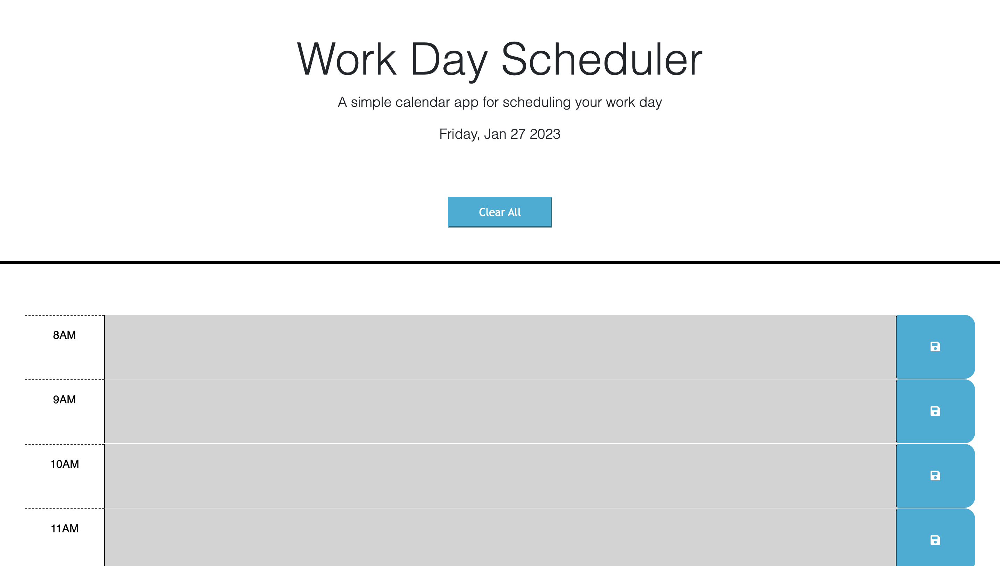

# Work Day Scheduler
#### Aubrey Johnston
 

## Technologies Used
<ul>
    <li>HTML</li>
    <li>CSS</li>
    <li>Javascript</derli>
</ul>    

 

## Description
The purpose of this site is to give users a place to input the tasks they need to do in a day and save them to one place. The information they input can be saved in local storage so they can come back to see what they have inputed and even clear the information they input if needed.

 

## Installation
No installation required. Just visit my deployed website link:
 
https://aubreyj11.github.io/calendar-challenge/

 

## Usage
To use this website, simply enter the information for the corresponding time slot according to what needs to get done at that time. The calendar stretches the hours of a normal 8am-5pm workday. After entering information into its section, press the blue save button at the end of that time slot's section to save the information and it will remain on the page even after page is reloaded. Press 'Clear All' button to clear all saved information in the calendar.  Calendar is color coded according to time of day and will update colors every hour. Grey is past, red is present, and green is future. 
   

